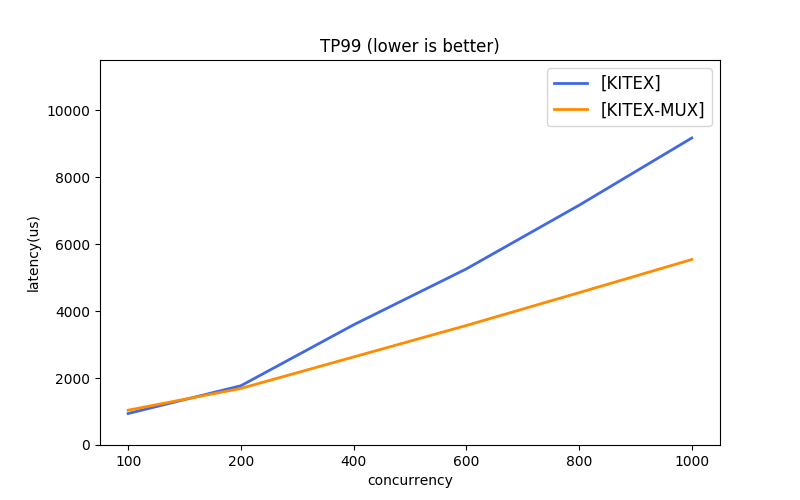
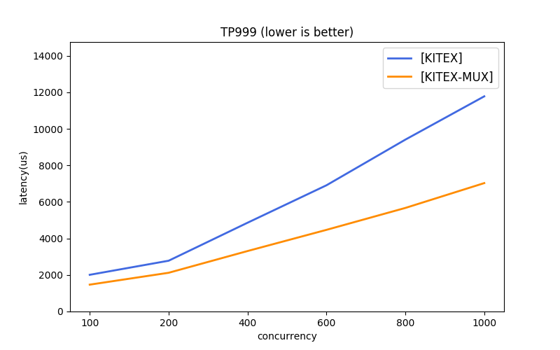
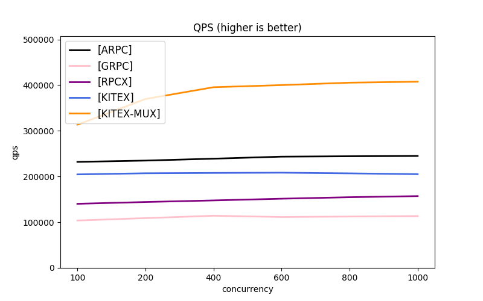
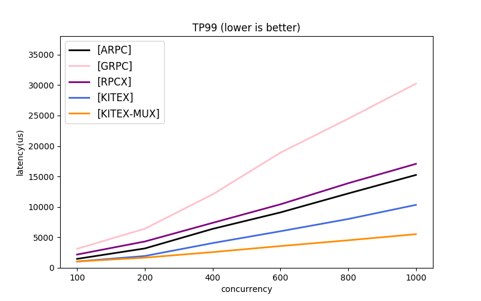
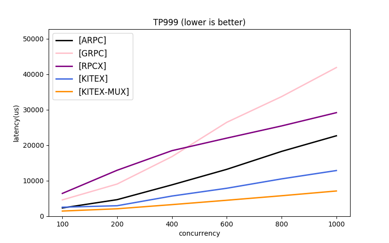
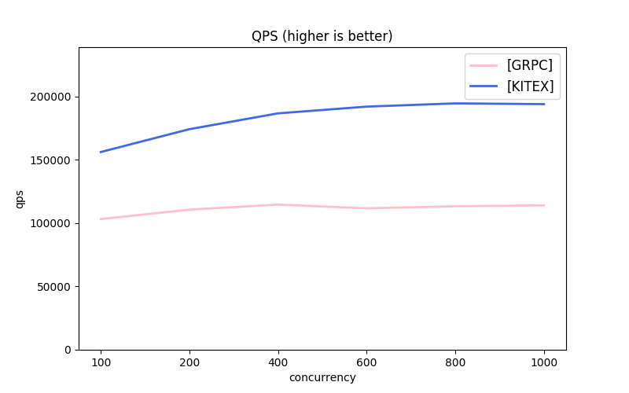
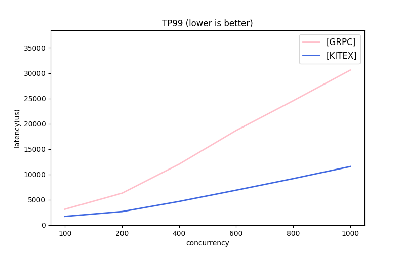
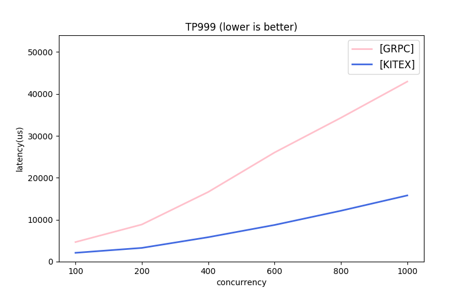

# kitex-benchmark

English | [中文](README_cn.md)

This project shows several simple uses of [kitex][kitex] and provides several comparison projects.

Due to the differences in the protocols and transmission modes used by different frameworks, it's difficult to benchmark them all under the same baseline. [kitex][kitex] gives several simple combinations for reference.

1. [kitex][kitex]:
	- Multi-Message Protocol: Thrift(recommended), KitexProtobuf(Customized Protobuf Message Protocol), GRPC(Same with gRPC)
	- Multi-Transmission Mode: long connection pool (recommended), connection multiplexing (mux)
2. Comparison Frameworks:
	- [Thrift][thrift]: Kitex is the only full-featured Thrift Golang Framework at now.
	- [Protobuf][protobuf]: [grpc][grpc], [rpcx][rpcx], [arpc][arpc] (all use connection multiplexing), but note that there are differences in message protocols.

## Usage

### Localhost Mode

Please make sure to meet [Requirements](#Requirements) before execution.

#### Thrift

```bash
./scripts/benchmark_thrift.sh
```

#### Protobuf

```bash
./scripts/benchmark_pb.sh
```

#### GRPC

```bash
./scripts/benchmark_grpc.sh
```

### External Network Mode

The packets in loopback network mode don't enter the network card, failing to truly simulate the online services communication. So it also provides an approach to bench the
client and server individually.

But it should be noted that if the host machine has more than the CPU cores set by taskset, the process will borrow other ksoftirqd kernel threads that are not controlled by taskset, and shares the computation of other CPUs. Therefore, it is recommended to use the same machine specification as taskset, or delete taskset when you use cross-node mode.

#### Thrift

```bash
# host A
./scripts/run_thrift_servers.sh

# host B
./scripts/run_thrift_clients.sh
```

#### Protobuf

```bash
# host A
./scripts/run_pb_servers.sh

# host B
./scripts/run_pb_clients.sh
```

#### GRPC

```bash
# host A
./scripts/run_grpc_servers.sh
# host B
./scripts/run_grpc_clients.sh
```

### Benchmark Diff

All benchmark result will be written at `./output`, and named as current time by default(or $REPORT):

```bash
$ scripts/benchmark_thrift.sh
$ ls output/
2021-12-13-21-40.log # raw output log
2021-12-13-21-40.csv # processed data

$ REPORT=feat-gopool scripts/benchmark_thrift.sh
$ ls output/
feat-gopool.log # raw output log
feat-gopool.csv # processed data
```

Diff two different benchmark results' csv files:

```bash
# Usage: python3 ./scripts/reports/diff.py target.csv current.csv

python3 ./scripts/reports/diff.py output/2021-12-13-21-40.csv output/2021-12-13-21-44.csv

# output:
# [KITEX-MUX]   100            1024           275604.66(+0.4%)     1.13(+0.0%)     2.01(-0.5%)
# [KITEX]       100            1024           218999.03(-0.4%)     1.28(-3.0%)     3.73(-2.1%)
```

### Profiling

Since the default benchmark will complete quickly, to obtain enough time to do profiling, you can increase the parameter `n` in `./scripts/env.sh`.

#### Profiling Client

```bash
go tool pprof localhost:18888/debug/pprof/{pprof_type}
```

#### Profiling Server

Find port mapping of different servers at the corresponding script, such as:

```bash
cat ./scripts/benchmark_pb.sh

# ...
repo=("grpc" "kitex" "kitex-mux" "rpcx" "arpc" "arpc-nbio")
ports=(8000 8001 8002 8003 8004 8005)
```

After obtaining the corresponding server port number, execute:

```bash
go tool pprof localhost:{port}/debug/pprof/{pprof_type}
```

### More scenarios

Modify the `./scripts/env.sh` file:

```bash
# Send pressure test request number
n=5000000
# Request body size
body=(1024 5120)
# Concurrency
concurrent=(100 200 400 600 800 1000)
# server handler sleep time (/ms), the default is 0
sleep=0
```

## Requirements

- OS: Linux
  * By default, it depends on the command `taskset` to limit the CPUs used by the client and server; if it is executed on other systems, please modify the script.
- CPU: Recommended >=20 cores, minimum >=4 cores
  * The benchmark script requires 20 CPUs by default, which can be modified or deleted in the `taskset -c ...` part of the script.

## Reference Data

**Notes:**

The benchmark ensures the caller has sufficient machine resources **overwhelming the server**, and focuses more on server performance. The performance data of the caller will be provided later.

### Specification

* CPU: Intel(R) Xeon(R) Gold 5118 CPU @ 2.30GHz
    * server 4-CPUs, client 16-CPUs
* OS: Debian 5.4.56.bsk.1-amd64 x86_64 GNU/Linux
* Go: 1.17.2

### Data (echo size 1KB)

- [Thrift Raw Data](scripts/reports/thrift.csv)
- [Protobuf Raw Data](scripts/reports/pb.csv)
- [GRPC Raw Data](scripts/reports/grpc.csv)

#### Thrift
Note: the message protocols used by each framework are different. About GRPC, the next part has comparison.





#### Protobuf





#### GRPC





[kitex]: https://github.com/cloudwego/kitex
[grpc]: https://github.com/grpc/grpc
[rpcx]: https://github.com/smallnest/rpcx
[arpc]: https://github.com/lesismal/arpc
[thrift]: https://thrift.apache.org
[protobuf]: https://developers.google.com/protocol-buffers/docs/gotutorial
